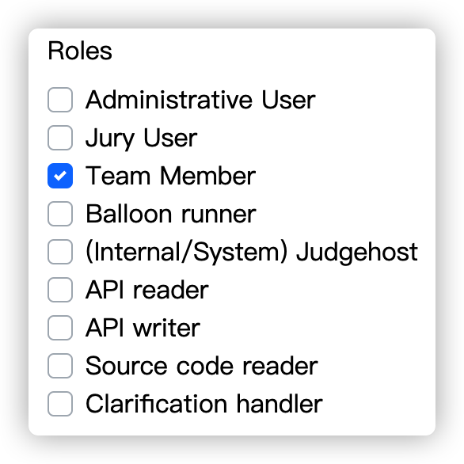
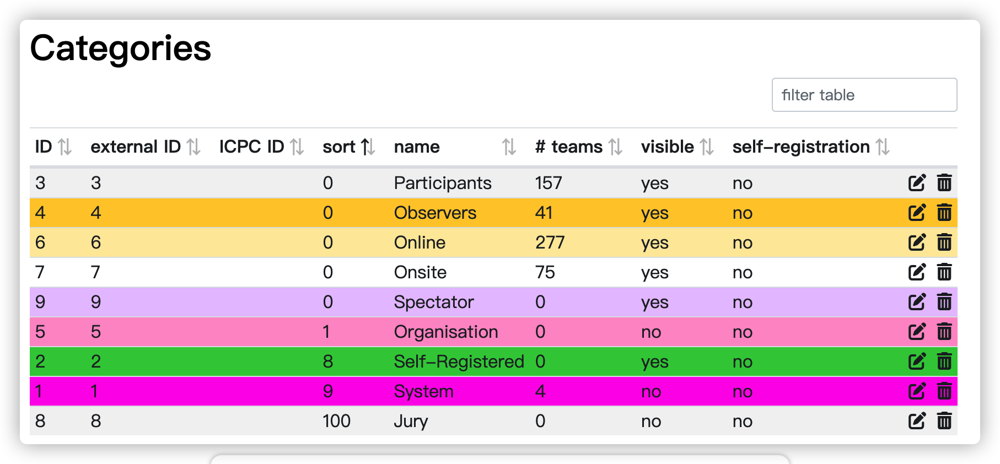
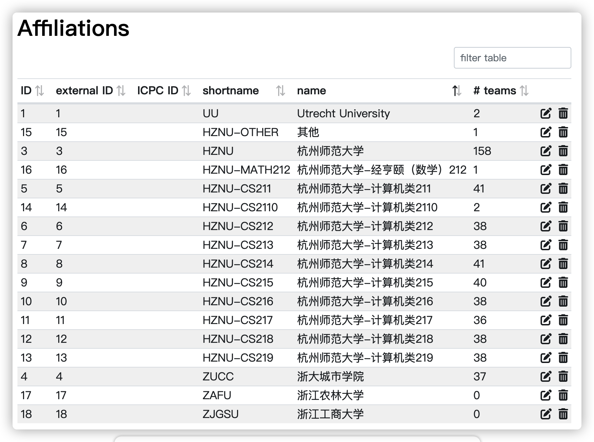
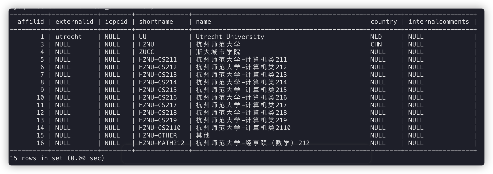
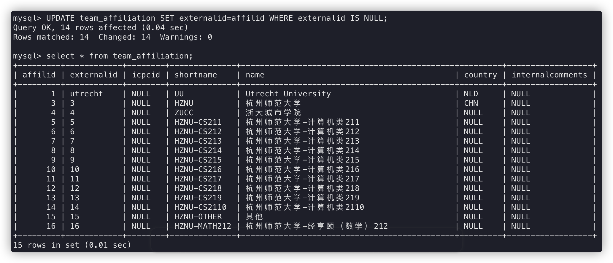
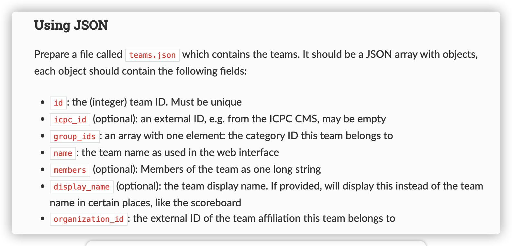
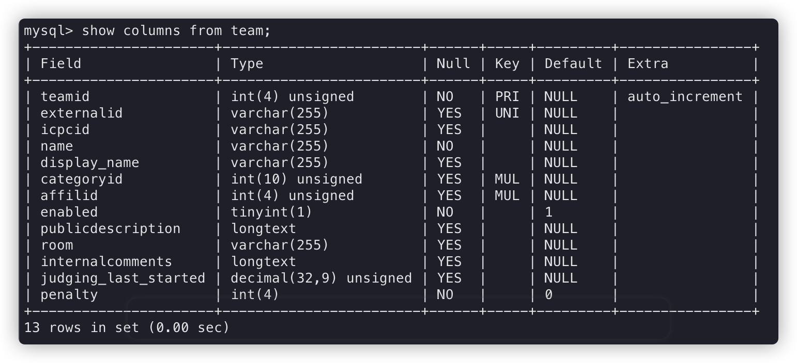
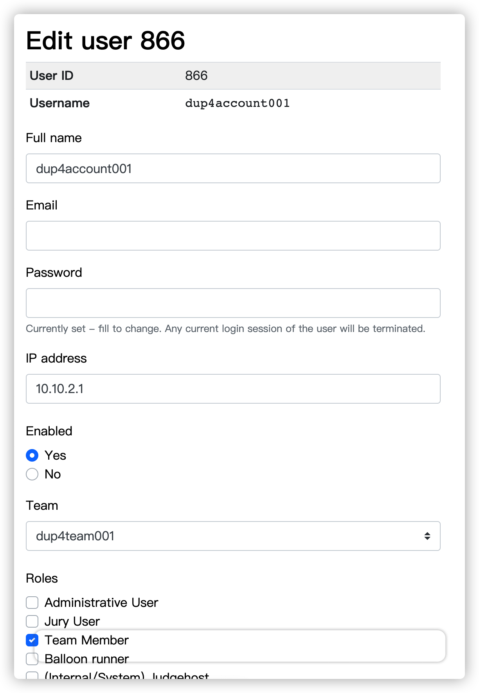

# DOMjudge Team Account Import Guide

本教程基于的 DOMjudge 版本为 `DOMjudge 8.1.0DEV/9b40150`。

???+ info "Contents"
    [TOC]

## Write in front

如果需要使用 import 功能，需要将 `Data source` 设置为 `configuration data external` 或者 `configuration and live data external`。

<center>


</center>

否则：

* 在 UI 界面新增新的 Team categories、Team affiliations、Team、User 等不会有 `External ID` 字段。
* 关联的时候，不会跟数据库表中的 `externalid` 关联。

社区中相关的讨论可以参考：https://github.com/DOMjudge/domjudge/issues/1574

## Basic concept

### Account

账号（Account），账号是进入系统的入口。

<center>

{ width=420px }

</center>

一个账号可以被赋予多个角色。

不同的角色代表具有不同的权限集合，被赋予多个角色的账号，它的权限集合是这几个角色的权限集合的交集。

### Contest

Contest 一般指一场比赛。

### Team

队伍（Team），是参加 Contest 的入口。

Team 与 Contest 是 **N:M** 关系，即一个 Team 可以参加多个 Contest，一个 Contest 中可以包含多个 Team。

而 Team 和 Account 是 **1:N** 关系，即一个 Team 可以绑定多个 Account，而一个 Account 只能绑定一个 Team。

当然，Team 可以不绑定某一个 Account，Account 也可以不绑定某一个 Team，即使赋予 Account 的角色是 Team Member。

### Team categories

这个是指 Team 的类别，常见的可能有以下几种类别。

<center>

{ width=600px }

</center>

Team categories 和 Team 是 **1:N** 关系，即一个 Team 只可以属于一个 Team categories，但是一个 Team categories 下可以挂着多个队伍。

这个一般不需要导入，如果需要增加 Team categories，也可以在管理界面操作，如果有导入的需求，可以参考[官方文档][importing-team-categories]

### Team affiliations

这个在区域赛中，一般会被赋予学校或者企业（比如企业打星队伍参赛）的含义。

在我们学校内部的比赛中，我们可能就会赋予它班级的含义，比如下图所示：

<center>

{ width=600px }

</center>

Team affiliations 和 Team 是 **1:N** 关系，即一个 Team 只可以属于一个 Team affiliations，但是一个 Team affiliations 下可以挂着多个队伍。

如果需要导入 Team affiliations，可以参考[官方文档][importing-team-affiliations]。

这里可能存在的一个问题在于：

> 现在这个问题已经不存在了。
>
> 之前出现这个问题，是由于没有正确设置 Data source，可以参考[Write in front](#write-in-front)。
>
> 不过如果有中途才发现的，可以参考下面的步骤，修复一下。

<center>



</center>

数据库里有一个字段是 `externalid`，这个字段会在 **导入队伍** 时用于绑定 Team 所属的 Team affiliations。

但是如果是通过 UI 界面新增的 Team affiliations，`externalid` 这个字段会为 `null`，并且后续在 UI 界面中无法编辑 `externalid` 字段。

所以，如果要在后续的 Import Teams 中，绑定到一个通过 UI 界面新增的 Team affiliations，那么可能需要操作数据库修改一下 Team affiliations 的 `externalid`。

为了下文的 Import Teams，通过操作数据库，将 `externalid` 赋值为 `affilid`，如下所示：

<center>



</center>

那么，对于下文来说，我们所需用到的 Team affiliations，可以认为 `externalid` = `affilid`。

## Import Teams

可以先查看 [官方文档][importing-teams] 得知相关的数据格式。

在下文中，我们采用 JSON 格式的文件。

我们用于导入所用的数据

```json title="teams.json"
---8<--
2022/5/domjudge-team-account-import-guide/teams.json
---8<--
```

<center>

{ width=720px }

</center>

虽然在 8.0 的官方文档中，声明 `id` 字段应该是个 Integer。

但是在示例中，`id` 字段是个 String，并且它在数据库中对应的是 `externalid`，是个 `varchar(255)` 类型。

<center>

{ width=720px }

</center>

这个 `typo` 在 `8.1.0DEV/9b40150` 中已经被修复。

上文中的 `teams.json`，导入之后，在数据库中是这样的：

<center>


</center>

可以发现 `teamid` 是自增的，不受我们控制的，而 `teams.json` 中的 `id` 对应数据库中的 `externalid`。

<center>

{ width=520px }

</center>

而上图是 UI 中的样子，可以对照上文中的 [Team categories](#team-categories) 和 [Team affiliations](#team-affiliations) 部分，会发现这个账号的 Categories 和 Affiliations 是符合我们预期的。

## Import Accounts

可以先查看 [官方文档][importing-accounts] 得知相关的数据格式。

```json title="accounts.json"
---8<--
2022/5/domjudge-team-account-import-guide/accounts.json
---8<--
```

<center>


{ width=520px }

</center>

导入的结果如上。

可以发现这个账号，和我们上文导入的 team 绑定在一起了。

## Reference

* https://www.domjudge.org/docs/manual/8.0/import.html

[importing-team-categories]: https://www.domjudge.org/docs/manual/8.0/import.html#importing-team-categories
[importing-team-affiliations]: https://www.domjudge.org/docs/manual/8.0/import.html#importing-team-affiliations
[importing-teams]: https://www.domjudge.org/docs/manual/8.0/import.html#importing-teams
[importing-accounts]: https://www.domjudge.org/docs/manual/8.0/import.html#importing-accounts
