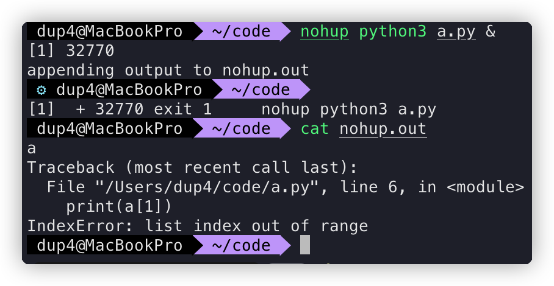

# 简单说说 nohup

nohup 是 Linux 中的一个命令。我们可以从 [Man Page][man-page] 中看到该命令的使用帮助。

其实我自己以前理解一直不清晰，一直以为 `nohup` 是用来让一个程序后台运行的命令，但实际上这个描述并不准确。

我们用一个简单的 Python 3 作为要运行的脚本：

```python3
import time

a = ["a"]
print(a[0])
time.sleep(10)
print(a[1])
```

这个脚本很简单，会输出如下内容：

```plain
a
Traceback (most recent call last):
  File "/Users/dup4/code/a.py", line 6, in <module>
    print(a[1])
IndexError: list index out of range
```

其中第一行的 `a` 属于 `stdout` （标准输出），剩下的属于 `stderr` （标准错误输出）。

我们考虑这样一个命令：

```bash
python3 a.py &
```


`&` 表示后台运行一个命令，但是并不会重定向输出，它仍然会输出到你的屏幕上，即 `stdout` 和 `stderr`。

> 有兴趣深入了解可以看下这个问题：<https://stackoverflow.com/questions/13338870/what-does-at-the-end-of-a-linux-command-mean>

并且如果只用 `&` 的话，在运行过程中，你退出了当前 shell，这个程序仍然会退出。

```bash
python3 a.py > a.out &
```

可以试试如上命令，看看在 `a.out` 中是否有预期输出。

为什么会退出呢？

可以从 [Signals](https://linux.die.net/Bash-Beginners-Guide/sect_12_01.html#:~:text=SIGHUP%20by%20default,shopt%20built%2Din.) 中了解到：

> SIGHUP by default exits a shell. An interactive shell will send a SIGHUP to all jobs, running or stopped;
>
> see the documentation on the disown built-in if you want to disable this default behavior for a particular process.
>
> Use the huponexit option for killing all jobs upon receiving a SIGHUP signal, using the shopt built-in.

当退出 shell 时，会向所有的任务发送 `SIGHUP` 信号，所以没有做特殊处理的话，所有任务都会被中断。

这个时候就很好理解 `nohup` 为什么叫 `nohup` 了吧，它就是用来屏蔽 `SIGHUP` 信号的，让程序免受中断。

这个时候再来回顾一下 `nohup` 在 [Man Page](https://linux.die.net/man/1/nohup#:~:text=nohup%20%2D%20run%20a%20command%20immune%20to%20hangups%2C%20with%20output%20to%20a%20non%2Dtty) 中的简介：

> nohup - run a command immune to hangups, with output to a non-tty

题外话：如果想了解 TTY 是什么，可以参考 [TTY 到底是什么？][what-is-tty]

可以了解到 `nohup` 除了帮助你屏蔽 `SIGHUP` 信号，还帮助重定向了输出。

我们试试下面这条命令：

```bash
nohup python3 a.py &
```



可以看到我没有做任何的重定向操作，但是输出自动重定向到了 `nohup.out` 当中。

其实从 [Man Page](https://linux.die.net/man/1/nohup#:~:text=If%20standard%20input%20is%20a%20terminal%2C%20redirect%20it%20from%20/dev/null.%20If%20standard%20output%20is%20a%20terminal%2C%20append%20output%20to%20%27nohup.out%27%20if%20possible%2C%20%27%24HOME/nohup.out%27%20otherwise.%20If%20standard%20error%20is%20a%20terminal%2C%20redirect%20it%20to%20standard%20output.%20To%20save%20output%20to%20FILE%2C%20use%20%27nohup%20COMMAND%20%3E%20FILE%27.) 中可以看到重定向策略：

> If standard input is a terminal, redirect it from /dev/null.
>
> If standard output is a terminal, append output to 'nohup.out' if possible, '$HOME/nohup.out' otherwise.
>
> If standard error is a terminal, redirect it to standard output.
>
> To save output to FILE, use 'nohup COMMAND > FILE'.

* `stdin` （标准输入）会被重定向到 `/dev/null`
* `stdout` （标准输出）被重定向到 `nohup.out` 或 `$HOME/nohup.out`
* `stderr` （标准错误输出）会被重定向到 `stdout` （标准输出）

我们可以认为：

```bash
nohup python3 a.py &
```

等价于

```bash
nohup python3 a.py < /dev/null > nohup.out 2>&1 &
```

其中：

* `1` 表示 `stdout`
* `2` 表示 `stderr`
* 另外，`0` 表示 `stdin`

不知你是否有个疑问，就是 `stderr` 重定向到 `stdout`，为什么不是 `2>1` 而是 `2>&1`。

这是因为 `2>1` 无法区分这个 `1` 是代表文件名还是代表 `stdout`。

有兴趣可以看一下这个回答 <https://superuser.com/a/846641>。

如果没有显式的重定向输入和输出，有的版本的 `nohup` 会提示你如下信息

```bash
nohup: ignoring input and redirecting stderr to stdout
```

那如果只用 `nohup`，而不用 `&`，会怎么样呢？

留给有兴趣的读者自己实验。

[man-page]: https://linux.die.net/man/1/nohup
[what-is-tty]: https://www.kawabangga.com/posts/4515
